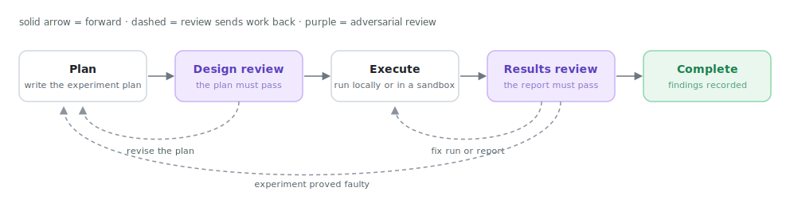
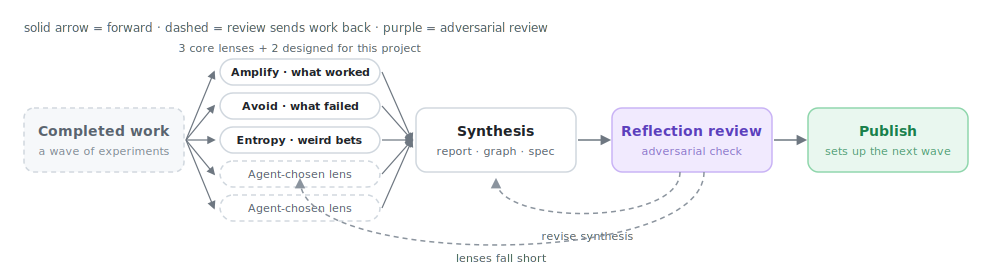
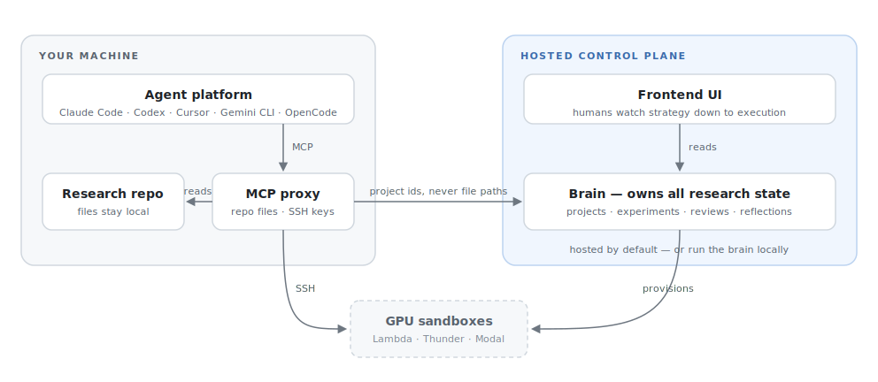

# Merv

Merv is a plugin for agentic coding platforms that helps agents run machine learning research as gated, reviewable experiment workflows.

It is designed to work with Claude Code, Codex, Cursor, Gemini CLI, OpenCode,
OpenHands, Replit Agent, and other MCP-capable agent platforms. It includes a
frontend for humans to observe agent behavior ranging from macro research
strategy to experiment execution specifics.

The goal is to give research agents enough structure to plan experiments, execute them, review results, and reflect on the project direction to handle open-ended research problems.

## Experiment-level workflow

<picture>
  <source media="(prefers-color-scheme: dark)" srcset="assets/experiment-workflow-dark.svg">
  
</picture>

Each experiment begins with a generated plan that is adversarially reviewed by another agent. The plan/review loop persists until the reviewer approves the plan. After approval, the agent proceeds to execution. When it is done, it submits a report that is adversarially reviewed by a different agent. The reviewer can send the agent back to execution to fix something in the execution or the report, or it can send it back to the planning stage if the experiment proved faulty.

## Project-level workflow

<picture>
  <source media="(prefers-color-scheme: dark)" srcset="assets/project-workflow-dark.svg">
  
</picture>

After a set of experiments is complete, the plugin drives a project-wide reflection. Five different sub-agents are called, each analyzing the wave's snapshot of all terminal experiments and current claim statuses under a different lens. Their goal is to look for patterns of what works, what does not, and what has not been tried, in order to set up the next phase of experiments. The analysis of the sub-agents is consolidated into a report, logic graph, and change spec. Those artifacts are adversarially reviewed by a different agent for accuracy.

## How the system fits together

<picture>
  <source media="(prefers-color-scheme: dark)" srcset="assets/system-architecture-dark.svg">
  
</picture>

Merv has three main pieces:

- **Agent adapters** connect Claude Code, Codex, Cursor, Gemini CLI, OpenCode,
  OpenHands, Replit Agent, and other agentic clients to the same workflow.
- **Backend** owns the research state: projects, claims, experiments, artifacts, review gates, reflections, and sandbox orchestration.
- **Frontend** gives humans a visual way to inspect the project: experiments, reviews, artifacts, logic graphs, timelines, and current progress.

By default the plugin connects to the hosted brain; it can also run fully
locally. In either deployment the checkout root and caller SSH private keys
stay on the user's machine. Agents send explicit project ids, typed metadata,
and selected submitted bytes; the brain never opens the checkout directly.
Brain management keys remain separate operational credentials.

## Set up

Merv is open source, and every part of it can be self-managed — see
[Self-hosting](#self-hosting) below. The fastest way to try it is against the
**hosted brain** at [rapidreview.io](https://rapidreview.io): the commands in
this section connect your agent platform to the hosted service. There is no
local proxy, no daemon, and no `pip` install on either path — every platform
connects directly to a brain's `/mcp` endpoint over HTTP.

Prerequisites are light: sandbox SSH and agent-run byte transfers use the
system `curl`, OpenSSH client, and `rsync`; Python 3.11+ is needed only for
the optional `merv-client`/`merv-http` CLIs.

### 1. Mint a project key

1. Open [RapidReview](https://rapidreview.io/map), sign in, and open (or
   create) the project this agent should be bound to.
2. Create a key for that project and copy it when shown — it is displayed once.
3. Export it where the agent runs:

```bash
export MERV_MCP_KEY=mk_...
```

A key binds exactly one project and is bearer-equivalent to full access to it:
treat it like a password, never commit it, and keep it in the environment
rather than in config files. Browser-configured platforms (claude.ai, Replit)
can use Merv's OAuth sign-in flow instead of a pasted key.

### 2. Connect your platform

**Claude Code** — two commands, then restart; skills and the `merv:` reviewer
agents are auto-discovered from the plugin:

```bash
claude plugin marketplace add https://rapidreview.io/marketplace.json
claude plugin install merv@rapidreview
```

**Codex CLI** — two commands install the full plugin (skills, reviewer
workflow, and the MCP server registration):

```bash
codex plugin marketplace add NGXT-Inc/Merv
codex plugin add merv@rapidreview
```

Then wire the key to the server (the plugin registers the endpoint; auth is
per-machine):

```bash
codex mcp add merv --url https://experiments.rapidreview.io/mcp \
  --bearer-token-env-var MERV_MCP_KEY
```

`codex mcp login merv` is the browser OAuth alternative. Connecting only the
MCP server with the `codex mcp add` line alone also works, but skips the
skills. Headless cloud tasks use the same server entry — expose
`MERV_MCP_KEY` to the task environment.

**OpenHands** — one command for the local CLI:

```bash
openhands mcp add merv --transport http \
  --header "Authorization: Bearer <project-key>" \
  https://experiments.rapidreview.io/mcp
```

For the local GUI, add the same URL as an `shttp_servers` entry in
`config.toml`; on OpenHands Cloud, add it under **Settings → MCP**. Details:
[clients/openhands/README.md](merv/clients/openhands/README.md).

**Gemini CLI** — one command from a checkout:
`gemini extensions install /path/to/merv`.

**OpenCode** — one script from a checkout:
[clients/opencode/install.sh](merv/clients/opencode/install.sh), then add the
`opencode.json` block it prints.

**Replit Agent** — in the workspace, open **MCP Servers → + Add MCP server**,
enter `https://experiments.rapidreview.io/mcp`, then **Test & save**. Replit
discovers Merv's OAuth flow and walks through sign-in and project consent.

**claude.ai (web)** — add a custom connector pointed at
`https://experiments.rapidreview.io/mcp`; the browser OAuth flow signs in and
scopes the connector to one project.

**Cursor** — Cursor has no plugin registry for local plugins, so this one is a
copy: clone the repo and mirror the bundle into `~/.cursor/plugins/local`
(Cursor rejects symlinks that point outside that directory):

```bash
git clone https://github.com/NGXT-Inc/Merv.git ~/Merv
rsync -a --delete --exclude '.venv' --exclude '__pycache__' --exclude '*.egg-info' \
  ~/Merv/merv/ ~/.cursor/plugins/local/merv/
```

Enable **merv** on Cursor's Customize page and restart (or **Developer:
Reload Window**). Update later with `git -C ~/Merv pull` + the same `rsync`.

Per-platform detail, reviewer-handoff workflow, and constraints:
[CLIENTS.md](merv/docs/CLIENTS.md) and the
[cross-platform matrix](merv/docs/AGENT_ANYWHERE.md).

### 3. First run

Open the repo you want to research as the workspace and ask the agent to call
`project(action="current")` — it returns the key's bound project and its id.
The agent passes that id as `project_id` on every project-scoped call,
starting with `workflow.status_and_next(project_id)`. Watch the project live
at [rapidreview.io/merv](https://rapidreview.io/merv).

## Self-hosting

The hosted service runs the same code that ships in this repo. To run the
full stack yourself — brain, Postgres, S3-compatible blob store, and MLflow —
start from the reference deployment in
[merv/deploy/README.md](merv/deploy/README.md) (`docker compose up` plus the
documented environment). For a bare local development brain, run
`merv/bin/merv-http` and point clients at `http://127.0.0.1:8787/mcp`.

Clients connect to a self-managed brain exactly as they do to the hosted one:
swap the `url` in the platform entry above (or run
`merv-client configure --control-url ...` once and `merv-client env` to print
the matching snippet). Key minting and OAuth work the same way against your
own deployment — see
[HOSTED_CLIENT_QUICKSTART.md](merv/docs/HOSTED_CLIENT_QUICKSTART.md) and
[CONTROL_PLANE_OPERATIONS.md](merv/docs/CONTROL_PLANE_OPERATIONS.md).

## Migrating from Research Suite (`research-plugin`)

Upgrading from the old `research-plugin`? Everything was renamed in v0.0012
and the hosted brain now requires sign-in, but your data carries over
untouched. See [MIGRATING.md](MIGRATING.md) for the per-client steps
(Claude Code, Cursor, Codex).
