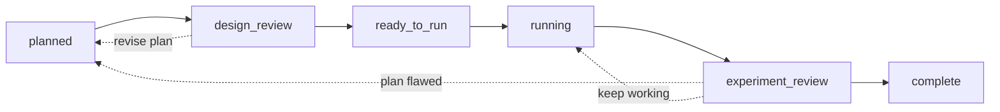
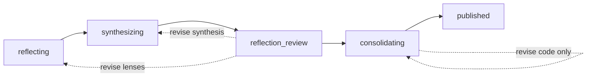

# Merv

Merv gives agentic coding clients (Claude Code, Codex, Cursor, Gemini CLI,
OpenCode, Kilo, Hermes Agent, OpenHands, Replit Agent) a shared state machine
for machine learning research: claims, experiments, submitted artifacts, review
gates, reflection waves, and sandboxed execution. A brain running locally or
as a hosted service owns durable research state; every agent client connects
directly to the brain's `POST /mcp` HTTP endpoint, authenticated by a
project-scoped key. The brain never receives the checkout root or reads it
directly; gated documents are explicitly uploaded as size-capped artifacts.

## Get started

```bash
git clone https://github.com/NGXT-Inc/Merv.git ~/Merv
```

That is the whole install — every agent client connects directly to the brain's
`/mcp` HTTP endpoint, so nothing runs on your machine to broker it and there are
no pip packages. Sandbox SSH and agent-run output pulls use the system OpenSSH
client and `rsync`, and tokenized artifact/storage transfers use `curl`. The
`merv-client` CLI, `merv-http`, the brain, and backend tests run on Python 3.11+.
Then:

1. Register the plugin in your client — per-client steps in
   [docs/CLIENTS.md](docs/CLIENTS.md).
2. For the hosted brain, export your project key as `MERV_MCP_KEY` — see
   [docs/HOSTED_CLIENT_QUICKSTART.md](docs/HOSTED_CLIENT_QUICKSTART.md).
3. Open your research repo and start a session:

```text
Use Merv. Start with project(action="list"), pick the project, then
workflow.status_and_next(project_id).
```

Each client connects straight to the hosted brain's `/mcp` endpoint. The committed
`.mcp.json` uses `type: "http"` and sends your key as `Authorization: Bearer
${MERV_MCP_KEY}`, so export `MERV_MCP_KEY` and keep it out of version control — a
key is bearer-equivalent to full access to everything it is scoped to, so never inline
it into a committed file. That key binds a single immutable project; the brain
scopes every call to it, with no per-folder linking or terminal setup. Details:
[docs/HOSTED_CLIENT_QUICKSTART.md](docs/HOSTED_CLIENT_QUICKSTART.md).

### Hermes Agent

Add this to `~/.hermes/config.yaml`, export `MERV_MCP_KEY`, then start `hermes`:

```yaml
skills:
  external_dirs:
    - ~/Merv/merv/skills
mcp_servers:
  merv:
    url: https://experiments.rapidreview.io/mcp
    headers:
      Authorization: "Bearer ${MERV_MCP_KEY}"
```

For OAuth, replace `headers` with `auth: oauth`, then run
`hermes mcp login merv`. See [docs/CLIENTS.md](docs/CLIENTS.md#use-with-hermes-agent)
for runner and reviewer setup.

## How work moves

Experiments move forward through two review gates; a rejected review sends the
work back (dashed):



Reflections distill what the project has learned, behind one gate of their own:



Merv can dispatch a reviewed experiment wave into separate local coding-agent
sessions. Configure any number of named platforms in the private machine file
`~/.merv/client.json`. Native process adapters cover Codex, Claude Code, Gemini
CLI, Cursor Agent, OpenCode, Aider, GitHub Copilot CLI, Qwen Code, and Hermes
Agent. The `command` adapter covers any other executable that accepts its
instruction on stdin:

```bash
bin/merv-client agent codex --enable --command codex --parallelism 2
bin/merv-client agent claude --enable --command claude --model opus
bin/merv-client agent hermes --enable --command hermes
bin/merv-client workspace --repository "$PWD" --strategy git_worktree
bin/merv-agent-runner --project proj_123
```

Automatic dispatch is off by default and is a per-project setting, so a running
runner claims nothing until the project turns it on in Settings. Turning it back
off stops new claims; sessions already running continue until you stop them from
the same page, which ends their agent processes and keeps their committed work.

Codex and Claude Code receive only Merv's session-scoped MCP server. Other
platforms invoke the same scoped tools through
`merv-client call TOOL --arguments JSON`; the session key remains in the
environment and is never placed on the command line.

The runner holds the ordinary project/account key. Each child gets a separate,
short-lived session key only through `MERV_AGENT_SESSION_KEY`; the key never
appears in the child prompt, argv, settings, or logs. Merv owns assignment,
leases, and recovery while each platform supplies only the local process.
The runner initializes a Merv-owned bare repository and central ref, then keeps
one persistent branch/worktree per experiment. Reflection approval dispatches a
separate consolidator and code reviewer; the runner alone advances central
after review. Temporary reviewer worktrees are removed, while experiment and
consolidation worktrees remain recoverable. The private bare clone has no
remotes and never pushes into the user's repository. Worktrees isolate Git
changes, not same-user filesystem access; use an OS sandbox for hostile agents.

The web Settings page can save this same machine file through the optional
runner control at `http://127.0.0.1:8791`. Start it without dispatching via
`bin/merv-agent-runner --settings-only` and paste the printed pairing token
into Settings. Only paired GET/PUT settings and status are exposed; starting
or stopping executable commands remains a local CLI operation. The pairing
token can edit executable agent commands, so treat it as local-administrator
authority and paste it only into a trusted Merv UI origin.

Agent-authored evidence is kept in regular repo files. The brain records their
relative paths and versions and pins selected submitted bytes for gates and
review. System metrics exhibits and optional heavy storage objects are separate
brain-managed artifacts.

## Running a local brain (optional)

For development, or to keep all state on your machine:

```bash
cd /path/to/merv
python3 -m venv .venv && .venv/bin/pip install -r requirements.txt
./bin/merv-http --host 127.0.0.1 --port 8787
bin/merv-client configure --control-url http://127.0.0.1:8787
```

Sandbox provider credentials (Lambda Labs by default; Thunder, Modal, and a
fake test backend via `MERV_EXECUTION_BACKEND`) belong to the brain
process only — see `.env.example`. Startup details:
[docs/STARTUP_CHEATSHEET.md](docs/STARTUP_CHEATSHEET.md).

## Tests

```bash
PYTHONPATH=src .venv/bin/python -m unittest discover -s tests
```

Set `MERV_EXECUTION_BACKEND=fake` to keep tests and local workflows
off cloud providers.

## Documentation

- [docs/CLIENTS.md](docs/CLIENTS.md) - per-client install and reviewer handoff
- [docs/HOSTED_CLIENT_QUICKSTART.md](docs/HOSTED_CLIENT_QUICKSTART.md) - hosted setup
- [docs/AUTH.md](docs/AUTH.md) - hosted authentication and project membership
- [docs/STARTUP_CHEATSHEET.md](docs/STARTUP_CHEATSHEET.md) - local startup flow
- [docs/ARCHITECTURE.md](docs/ARCHITECTURE.md) - backend and mode architecture
- [docs/MODULE_BOUNDARIES.md](docs/MODULE_BOUNDARIES.md) - enforced backend dependency law
- [docs/MCP_SERVER_CONTRACT.md](docs/MCP_SERVER_CONTRACT.md) - MCP tools and contracts
- [docs/WORKFLOW_AND_REVIEW.md](docs/WORKFLOW_AND_REVIEW.md) - workflow gates and reviews
- [docs/REVIEW_IDENTITY.md](docs/REVIEW_IDENTITY.md) - reviewer session and capability boundary
- [src/merv/brain/artifacts/artifacts.md](src/merv/brain/artifacts/artifacts.md) - submitted-artifact lifecycle
- [src/merv/brain/object_storage/object_storage.md](src/merv/brain/object_storage/object_storage.md) - durable heavy-object storage
- [docs/UI_API.md](docs/UI_API.md) - frontend HTTP API
- [docs/CONTROL_PLANE_OPERATIONS.md](docs/CONTROL_PLANE_OPERATIONS.md) - hosted operations and security boundary
- [deploy/README.md](deploy/README.md) - reference control-plane deploy
